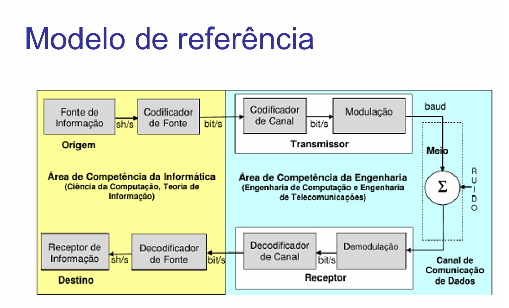
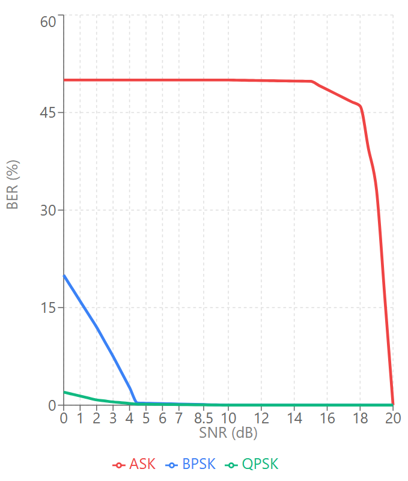

# GB_RedesII_2025_2
Trabalho do Grau B de Redes de Computadores: Internetworking, Roteamento e Transmissão. Curso de Ciência da Computação da UNISINOS 2025/2

# Integrantes
- Cássio F. Braga
- Gabriel C. Walber

# Objetivo
Desenvolver e aplicar os conceitos de codificação de canal e modulação digital estudados na disciplina de Redes de Computadores, analisando seu impacto na taxa de erro de bits (BER) e na eficiência espectral de sistemas de comunicação.

# Tecnologias Utilizadas
- Linguagem: C++
- Dear ImGui
- SDL 3
- OpenGL 3

# Funcionamento
Todas as etapas de interação com o sinal, tanto na codificação quanto na decodificação são visíveis através de gráficos plotados com o Dear ImGui.
A codificação utilizada é a Manchester, que utiliza a transição de nível de sinal para definir se um bit é 0 ou 1.
Para a modulação, implementamos a BPSK, QPSK e ASK.

## BPSK
Utiliza a variação de fase da portadora para definir se o bit transmitido é 0 ou 1. Quando o bit muda, a fase muda em 180º

## QPSK
Simula uma variação de fase em dois eixos perpendiculares, onde cada par de bits vira um símbolo. 00 fica como um seno, 01 como cosseno, 10 e 11 sendo seus inversos nessa ordem.

## ASK
Deixa a portadora com sinal 0 quando o bit é 0, e com o sinal de portadora quando o bit é 1.

## Ruído
Aplica um ruído branco no sinal antes de realizar as etapas de decodificação e demodulação.

## Demodulação e decodificação
Quando o sinal é demodulado, calcula a BER baseada na quantidade de bits que é diferente dos bits transmitidos.


A imagem de modelo de referência é creditada ao professor Cristiano Bonato Both, da disciplina de Redes de Computadores: Internetworking, Roteamento e Transmissão.

## 🎥 O vídeo de demonstração pode ser visto [aqui](https://streamable.com/m0fe04)

## 📈 Gráfico da BER em função da SRN


## Análise dos gráficos:
- QPSK apresenta melhor desempenho com menor BER em 4.5dB (0.15%)
- BPSK tem desempenho próximo ao QPSK (0.325% em 4.5dB)
- ASK apresenta pior desempenho com 50% de BER em baixo SNR

# Como Executar
Abaixo uma descrição de como realizar a compilação e execução do projeto.
Créditos à professora Rossana Baptista Queiroz de Processamento Gráfico pela descrição, que funciona da mesma forma que em nosso projeto.

# Configuração do Ambiente para Computação Gráfica com 

Este tutorial irá guiá-lo pela instalação e configuração do ambiente para rodar projetos OpenGL com **CMake** e **VS Code**, utilizando o **MinGW-UCRT64** como compilador (portanto, no **Windows** ).

## ⚠️ Importante: Diferenças entre Windows, Linux e macOS

Este tutorial foi desenvolvido para Windows utilizando MSYS2 UCRT64 como ambiente de compilação. Caso esteja utilizando Linux ou macOS, algumas configurações podem ser diferentes, especialmente na escolha do compilador C/C++ e na configuração do CMake.

Para configurar corretamente o compilador no VS Code no Linux ou no MacOS, siga os guias oficiais:

🔗 [Linux: Configuração do VS Code para C++ no Linux](https://code.visualstudio.com/docs/cpp/config-linux)  
🔗 [macOS: Configuração do VS Code para C++ no macOS](https://code.visualstudio.com/docs/cpp/config-clang-mac)  

Caso tenha dificuldades na configuração do CMake, consulte a documentação oficial:  
🔗 [CMake Documentation](https://cmake.org/documentation/)

---

## 📌 1. Instalando as Ferramentas Necessárias

Antes de começar, certifique-se de ter os seguintes programas instalados:

### 1️⃣ Instalar o 

Baixe e instale o **CMake** a partir do site oficial:
🔗 [CMake Download](https://cmake.org/download/)

Durante a instalação, **habilite a opção "Add CMake to system PATH"** para facilitar o uso no terminal.

---

### 2️⃣ Instalar o Compilador MinGW-UCRT64 através do 


Baixe o **MSYS2** através do link:
🔗 [MSYS2 Download](https://www.msys2.org/)

Provavelmente ao terminar de instalar, abrirá um terminal. Caso isso não aconteça, digite "msys" na barra de pesquisa do Windows e entre neste aplicativo:

 

Execute o seguinte comando para instalar os pacotes necessários:

```sh
pacman -S --needed base-devel mingw-w64-ucrt-x86_64-toolchain
```

Caso queira ou necessite de mais suporte nesta etapa, consulte o manual oficial:

🔗 [Configuração do VS Code para C++ no Windows](https://code.visualstudio.com/docs/cpp/config-mingw)

### Configurando a variável de ambiente no Sistema Operacional (Windows)

Esse passo garante que o sistema operacional encontre o compilador automaticamente ao rodar comandos no terminal, sem precisar especificar o caminho completo. A forma mais simples de fazer isso (se você tiver permissão de administrador do sistema) é a seguinte:

 - Edite a variável de caminhos do sistema operacional (`PATH`), acrescentando o caminho onde ficaram os executáveis do compilador (provavelmente ficaram em `C:\msys64\ucrt64\bin` - ou onde você escolheu instalar)


 - Se estiver em um computador que não tenha acesso de adm, adicionar temporariamente ao path com este comando (via terminal CMD): 
```sh
   set PATH=%PATH%;C:\msys64\ucrt64\bin
```
---

### 3️⃣ Instalar o VS Code 

Baixe e instale o **VS Code** pelo link:
🔗 [VS Code Download](https://code.visualstudio.com/)

Após a instalação, abra o **VS Code** e instale as seguintes extensões:

- **CMake Tools** ➝ Para integração com o CMake.
- **C/C++** ➝ Para suporte à IntelliSense e depuração.
  
Para isso, você pode ir no menu View -> Extensions ou clicar no ícone  da interface do Visual Studio Code.

---

### 4️⃣ Instalar o Git (Necessário para o CMake FetchContent) 

O **CMake FetchContent** baixa automaticamente dependências, como o **SDL**, e para isso ele precisa do **Git** instalado no sistema.

- **Baixe e instale o Git** pelo site oficial:  
🔗 [Download Git](https://git-scm.com/downloads)  

Durante a instalação, **habilite a opção "Add Git to PATH"**, para que ele possa ser acessado pelo CMake.

- **Verifique se o Git está instalado corretamente** executando no terminal (CMD ou PowerShell):  

```sh
git --version
```

Se aparecer algo como **`git version 2.x.x`**, significa que a instalação foi bem-sucedida.

---

## 📌 2. Clonando o Repositório de Exemplo

Agora vamos baixar o código de exemplo:

1️⃣ **Clone o repositório** no diretório de sua escolha:

```sh
git clone https://github.com/BragaF-Cassio/GB_RedesII_2025_2.git
```
Se você nunca usou o git, pode fazê-lo utilizando o 🔗 [Github Desktop](https://desktop.github.com/download/).

2️⃣ Abra o VS Code e vá em `Arquivo -> Abrir Diretório` (ou `File -> Open Folder`). Selecione o diretório onde você clonou o repositório de exemplo.


⚠️ É muito importante entrar no diretório do projeto pelo comando `Open Folder`. Caso contrário, o VS Code não reconhece o diretório `${workspaceFolder}`, o que poderá causar problemas no passo de compilação.

---

## 📌 3. Configurando o CMake no VS Code

1️⃣ No VS Code, pressione `Ctrl + Shift + P` e procure por `CMake: Scan for kit`


2️⃣ Logo após, pressione novamente `Ctrl + Shift + P` e procure por `CMake: Select a Kit`.  

3️⃣ **Selecione o compilador correto**:
   - Escolha `GCC for MSYS2 UCRT64` (ou similar, conforme sua instalação)
     
     

4️⃣ Este passo costuma acontecer automaticamente. Mas caso não ocorra nada após selecionar o kit, pressione `Ctrl + Shift + P` e execute `CMake: Configure`
   - Isso fará o **CMake detectar o compilador correto e preparar o projeto**. Espera-se que, após esta etapa, tenha-se uma saída similar a esta no terminal do VS Studio Code:
  
   

## 📌 4. Compilando e Executando o Projeto

Da mesma forma que o **CMake: Configure** pode executar automaticamente, a compilação pode ocorrer em sequência também de forma automática.
Caso não ocorra ou você pretenda compilar novamente:

1️⃣ Pressione `Ctrl + Shift + P` e execute `CMake: Build`
   - Ou rode manualmente no terminal:

   ```sh
   cd build
   cmake --build .
   ```

2️⃣ **Execute o programa**:
   ```sh
   ./graph_analyzer.exe
   ```

Se tudo estiver correto, o projeto será compilado e executado com sucesso! 🚀

---


